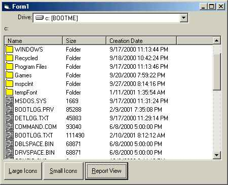



## Listview with FileNames and FileSizes

### Description

To demonstrate using listview to view files and directories.
 
### More Info
 
This code is not %100. I would test it under more conditions and add file associations.

             |
---                |---
**Submitted On**   |2001-02-10 10:24:12
**By**             |[http://www\.mp3trivia\.com](https://github.com/Planet-Source-Code/PSCIndex/blob/master/ByAuthor/http-www-mp3trivia-com.md)
**Level**          |Intermediate
**User Rating**    |4.0 (8 globes from 2 users)
**Compatibility**  |VB 6\.0
**Category**       |[VB function enhancement](https://github.com/Planet-Source-Code/PSCIndex/blob/master/ByCategory/vb-function-enhancement__1-25.md)
**World**          |[Visual Basic](https://github.com/Planet-Source-Code/PSCIndex/blob/master/ByWorld/visual-basic.md)
**Archive File**   |[CODE\_UPLOAD154632242001\.zip](https://github.com/Planet-Source-Code/http-www-mp3trivia-com-listview-with-filenames-and-filesizes__1-21319/archive/master.zip)

